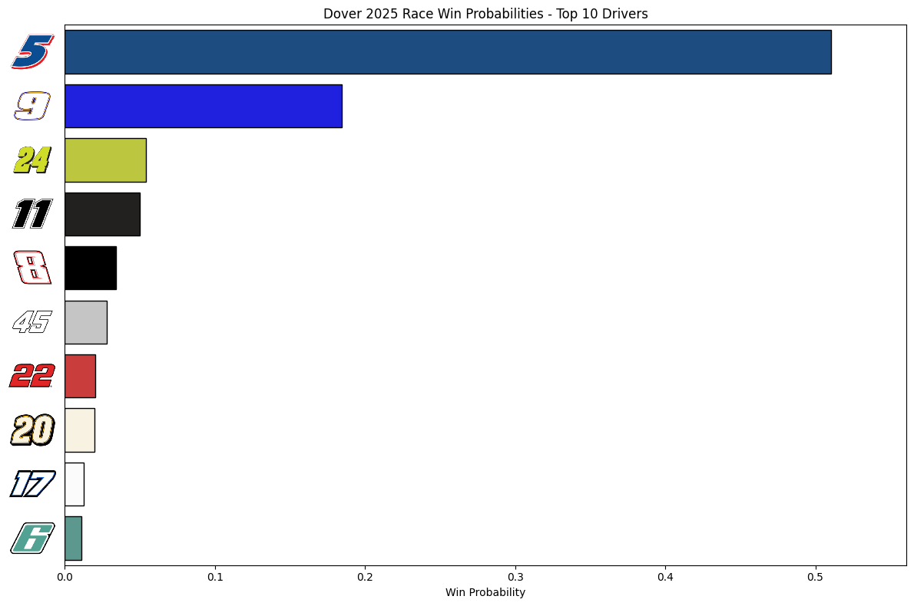
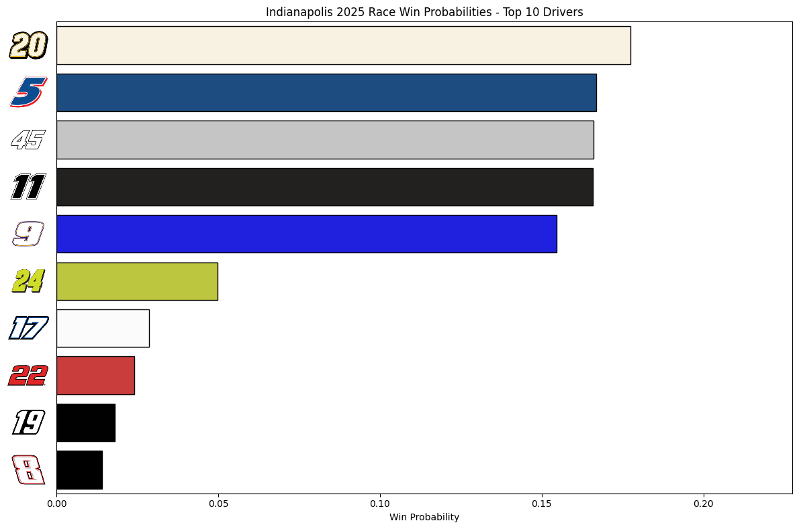
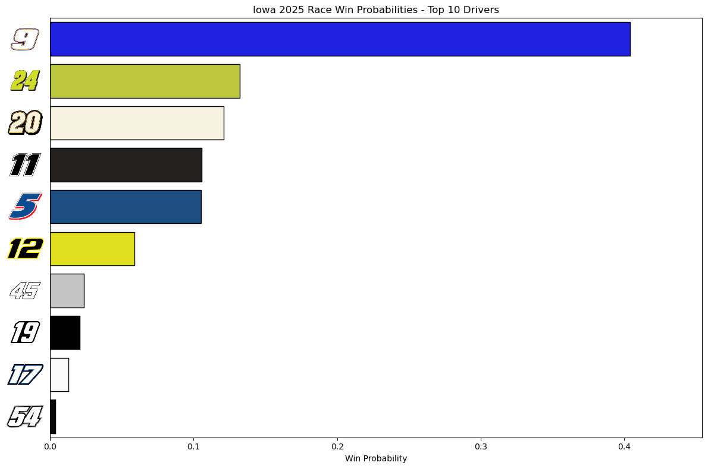
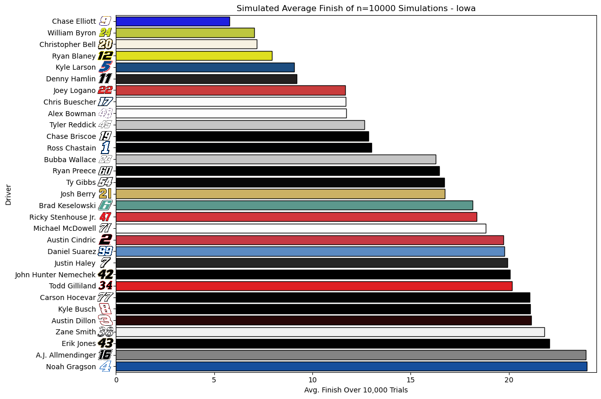

# 🏁 2025 Season NASCAR Race Win Prediction via Monte Carlo Simulation

<sub>Kind of... I started this in June.</sub>

A data-driven simulation tool to predict the winner of a NASCAR Cup Series race using Monte Carlo methods. This project uses historical driver data, DNF rates, and performance metrics to simulate thousands of race outcomes.

Read more about how a Monte Carlo simulation works [here](https://www.ibm.com/think/topics/monte-carlo-simulation)

For the full NASCAR Cup Series schedule, click [here](https://www.nascar.com/nascar-cup-series/2025/schedule/)

--- 

## 🗳️ Predictions and Evaluation By Track:

*Betting odds sourced from the Fanatics Sportsbook iPhone App, learn more [here](https://betfanatics.com/)*

*As the author of this project, I do not endorse sports betting in any form. I simply include betting odds to evaluate my model's predictive performance. If you choose to bet on sports, please do not use these predictions as your sole source of information. Gambling involves risk and should be approached responsibly. This project is intended for educational and analytical purposes only.*

### 🏔️ Pocono Raceway: The Tricky Triangle

<details>
   
<summary>Predictions</summary>
   
**Prediction:**

| 🥇 #1           | 🥈 #2           | 🥉 #3           |
|----------------|----------------|----------------|
| **#24** Byron  | **#11** Hamlin | **#5** Larson  |
|      +600 (T2)  |    +400 (1)   |    +600 (T2)   |

<sub>Odds updated 06/17/2025.</sub>

**My Top 10:**


**My Personal Pick:**

Kyle Larson has been completely out of luck since the debacle when he tried to perform the double. He's my top pick, along with Hamlin due to his dominance at Pocono, as well as Hocevar hopefully finally getting win No. 1. A late race skirmish between the 11 and the 5 like we saw in 2023 would not surprise me.

**Race Result:**

| 🥇 #1           | 🥈 #2           | 🥉 #3           |
|----------------|----------------|----------------|
| **#19** Briscoe  | **#11** Hamlin | **#12** Blaney  |
|     +2500 (15)  |    +400 (1)   |    +700 (4)   |


**Comments On Predictive Performance:**

I think that, overall, the model performed decently well. I think that Briscoe winning at Pocono was a card that not many people saw coming. Chase went out, had a fantastic race, and was supported by the rest of the JGR #19 team, an all around executional masterpiece. Hamlin came exactly where predicted, showcasing the biggest strength of the model in that it takes drivers' previous results at the track as a priority while using other statistics as weighting. Lastly, Blaney in third is also very close to what my model had. Overall, as the first run of this model, I am very happy about how it went, and I am eager to fine tune it for future races.

</details>

### 👹 Dover Motor Speedway: The Monster Mile

<details>
   
<summary>Predictions</summary>
   
**Prediction:**

| 🥇 #1           | 🥈 #2           | 🥉 #3           |
|----------------|----------------|----------------|
| **#5** Larson  | **#9** Elliott | **#24** Byron  |
|      +430 (1)  |    +1000 (5)   |    +650 (T3)   |

<sub>Odds updated 07/15/2025.</sub>

**My Top 10:**



**My Personal Pick:**

I think the bias is real here: my model says Larson, Vegas says Larson, I am a huge Larson fan so it looks like I'm riding with Kyle Larson this weekend. Along with Larson, I think this race could be the turning point, or rather the point where some *other* drivers who are in a bit of a slump are able to lock back in, so I like Blaney and C Bell for this race too. I think my personal longshot is going to be *Cinnamon Toast* (Chris) Buescher.

**Race Result:**

| 🥇 #1           | 🥈 #2           | 🥉 #3           |
|----------------|----------------|----------------|
| **#11** Hamlin  | **#19** Briscoe | **#48** Bowman  |
|      +470 (2)  |    +1900 (T9)   |    +1900 (T9)   |

**Comments On Predictive Performance:**

I am not super happy with how today went, albeit not necessarily dissappointed in model performance. Everything was looking perfectly smooth up until the red flag flew for rain with 14 laps to go. I will say, this is exactly the kind of scenario that I want to be able to plan for, but overall, not super unhappy. I think prior to the rain delay, I was in a fantastic spot, and honestly up until the Bell spin off the red flag. Each of my predicted top 3 were able to fight for a win today, which I can be happy about. Definitely want to make some big changes in the overall methodology of the simulation after that. Will be back next week for the Brickyard.

</details>

### 🧱 Indianapolis Motor Speedway: The Brickyard

<details>
   
<summary>Predictions</summary>
   
**Prediction:**

| 🥇 #1           | 🥈 #2           | 🥉 #3           |
|----------------|----------------|----------------|
| **#20** Bell  | **#5** Larson | **#45** Reddick  |
|      +1200 (7)  |    +500 (2)   |    +900 (5)   |

<sub>Odds updated 07/23/2025.</sub>

<sub>Picks made with 30% weight on track specific performance, 70% based off season performance to date.</sub>

**My Top 10:**



**Notable Model Changes For This Race**

- Added in custom weighting between track specific and season specific performance

**My Personal Pick:**

I didn't have time to type this up pre race, I'm currently travelling, but I thought Larson, Byron, or Hamlin were the guys coming into the race.

**Race Result:**

|                       | 🥇 #1              | 🥈 #2             | 🥉 #3             |
|-----------------------|--------------------|-------------------|------------------|
| **Driver**            | **#23** Wallace     | **#5** Larson      | **#11** Hamlin    |
| **Vegas Odds**        | +1500 (10)          | +500 (2)           | +750 (4)          |
| **Sim Prediction**    | 14th| ⭐️ 2nd ⭐️ | ✨ 4th ✨|

**Comments On Predictive Performance:**

What an awesome drive by Bubba, holding off mother nature, two overtimes, and gung ho Kyle Larson in your rearview was awesome to watch, even as a huge Larson fan. I am stoked at how my model did, even if I had the eventual race winner predicted to end up 14th. Beyond just the winner, I really hit the nail on the head for the most part. Obviously I need to keep fine tuning the waiting, doing all the enhancements I laid out for myself, and so on. Also, I really need to start looking at how Vegas has their pre race odds, comparing and contrasting what I get, and using some sort of formula to translate my predictions into actual betting odds to see how they hold up side by side.

</details>

### 🌽 Iowa Speedway: The Cornfield

<details>
   
<summary>Predictions</summary>
   
**Prediction:**

|                       | 🥇 #1              | 🥈 #2             | 🥉 #3             | #4              | #5             |
|-----------------------|--------------------|-------------------|------------------|------------------|----------------|
| **Driver**            | **#9** Elliott     | **#24** Byron     | **#20** Bell     | **#11** Hamlin   | **#5** Larson  |
| **Vegas Odds**        | +975 (6)           | +900 (5)          | +460 (2)         | +520 (4)         | +450 (1)       |
| **Sim Prediction**    | 1st                | 2nd               | 3rd              | 4th              | 5th            |

<sub>Odds updated 07/30/2025.</sub>

<sub>Picks made with 15% weight on track specific performance, 85% based off season performance to date.</sub>

**My Top 10:**



**All Drivers' Avg Finishes:**



**Notable Model Changes For This Race**

- None (On vacation, not much time to do much other than run preds)

**My Personal Pick:**

I personally think that anyone in my predicted top ten has a really good shot. I really like Ty Gibbs at 10th highest predicted win probability, he is due for a win any race now, and I wouldn't be shocked to see him win at a newer track like Iowa. Along with him, I think Blaney could really bring it, he was unstoppable last year, but wouldn't count out a guy like Buescher who needs to win to get in to the playoffs. Again though, we could see this end of the regular season resurgence from guys like Larson and Bell who started hot at the beginning of the year. Going to be a great race for sure!

**Race Result:**

|                       | 🥇 #1              | 🥈 #2             | 🥉 #3             | #4              | #5             |
|-----------------------|--------------------|-------------------|------------------|------------------|----------------|
| **Driver**            | **#24** Byron     | **#19** Briscoe     | **#6** Keselowski     | **#12** Blaney   | **#60** Preece  |
| **Vegas Odds**        | +900 (5)           | +1700 (8)          | +3000 (15)         | +510 (3)         | +4750 (19th)       |
| **Sim Prediction**    | ✨ 2nd ✨              | 8th               | 26th              | 6th              | 11th            |
| **Winner**            | MC Sim            | Tie                |  Sportsbook           | Sportsbook       |    MC Sim      |

**Comments On Predictive Performance:**

I think, obviously, I performed well where my sim performed better than the Vegas odds, as well as in the case of Briscoe. The one case that really sticks out to me is Brad Keselowski. I can clearly see the issue here is the fact that I only had one race to go off of for Iowa, as long as the fact that Brad is having a down year. If I had included overall career stats in the weighting for tracks with a small sample size (Iowa, Chicago Street Race, COTA, etc.), it would be really helpful.

</details>

---

## 📂 Project Structure

*Structure subject to change as project evolves*

NASCAR-Race-Predictions/

├── Data/

│ ├── All track specific, season specific, and 'Master' data here, including driver roster and .png images of driver number logos

├── Code Notebooks/

│ └── Here you can find all the code I have run to produce predictions in ipynb files. I plan writing plain .py scripts in the future to allow more accesibility. 

├── Predictions/

│ └── Find all plots and visualizations I produce from my predictions here.

├── User-GUI/

│ └── Find the .py script to launch the GUI to run your own predictions here.

├── README.md

│ └── That is me.


---

## 🧠 Methodology

1. **Data Collection**  
   Driver statistics (average finish, laps led, DNF count, etc.) sourced from [DriverAverages.com](https://www.driveraverages.com).

2. **Feature Engineering**  
   - Calculated `DNF_Prob` using custom logic based on past races and DNFs.
   - `Laps Led Per Race` to reflect dominance potential.
   - `Standard Deviation` for simulating finish variability.

3. **Simulation**  
   - Each race run using a Monte Carlo simulation.
   - DNF outcomes handled probabilistically.
   - Finished positions sampled from a normal distribution around each driver’s average with custom standard deviation.

4. **Results**  
   - Simulation run 10,000+ times.
   - Win probabilities estimated based on number of wins across simulations.

---

## 📊 Visualization

The top drivers' win probabilities are displayed using a horizontal bar chart, more visualization enhancements are planned.

---

## 🔁 Run the Simulation

### 💻 Requirements

The following libraries are required, run this line in your Python environment to install all of them

```bash
pip install pandas numpy matplotlib seaborn requests beautifulsoup4
```

*Once project is expanded upon, more info on running your own simulation will go here*

--- 

## 📈 Future Improvements

- Include pit crew performance metrics.

- Factor in qualifying position and starting grid.

- Add better post race evaluation visualizations and error calculation. -- Getting there, just added mean avg finish and std. dev

- Along w/ GUI, add different model types (ML models), along with different weighting decisions (Focus more on track statistics, focus more on season statistics, etc.)

- Add a `road-course-weight` feature for road courses (significantly help drivers like SVG, Allmendinger)
 
- ~~Add GUI dashboard (once a good base of tracks has been added).~~

- ~~Implement web crawling to pull statistics from the sources.~~
  
- ~~Extend to multiple tracks across the season.~~

- ~~Factor in non track-exclusive driver statistics~~

---

## 📚 Data Source

Driver data from: [DriverAverages.com](https://www.driveraverages.com/)

Driver number logo images from: [NASCAR Website](https://www.nascar.com/drivers/nascar-cup-series/)

---

## ❤️ Project Motivation

I have always been a massive NASCAR fan, and as I have begun working on projects within data science related to sports, I have seen the huge gap that is present in NASCAR with data utilization. While this project is a simple one, I think it is fascinating getting to use some concepts I am familiar with via school and industry work in a setting of a sport I love. I hope too that data science students just like me could find inspiration from this project.

---

## 🧑‍💻 Author
[Jacob Lukasik](https://www.linkedin.com/in/jacob-lukasik-00306826b/) | Penn State B.S. Data Science | Graduating Fall 2025
