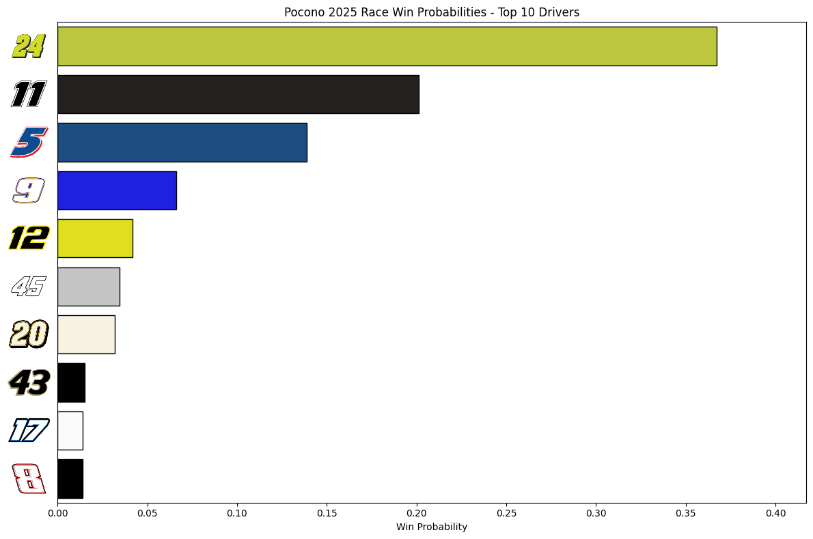

# 🏁 2025 Season NASCAR Race Win Prediction via Monte Carlo Simulation

A data-driven simulation tool to predict the winner of a NASCAR Cup Series race using Monte Carlo methods. This project uses historical driver data, DNF rates, and performance metrics to simulate thousands of race outcomes.

Read more about how a Monte Carlo simulation works [here](https://www.ibm.com/think/topics/monte-carlo-simulation)

--- 

## Predictions By Track:

*Betting odds sourced from the Fanatics Sportsbook iPhone App, learn more [here](https://betfanatics.com/)*

*As the author of this project, I do not endorse sports betting in any form. I simply include betting odds to evaluate my model's predictive performance. If you choose to bet on sports, please do not use these predictions as your sole source of information. Gambling involves risk and should be approached responsibly. This project is intended for educational and analytical purposes only.*

### 🏔️ Pocono Raceway:

**Prediction:**

| 🥇 #1           | 🥈 #2           | 🥉 #3           |
|----------------|----------------|----------------|
| **#24** Byron  | **#11** Hamlin | **#6** Keselowski  |

My Top 10:



**Race Result:**

| 🥇 #1           | 🥈 #2           | 🥉 #3           |
|----------------|----------------|----------------|
|   |  |   |

---

## 📂 Project Structure

*Structure subject to change as project evolves*

NASCAR-Race-Predictions/

├── Pocono-Driver-Data/

│ ├── pocono-sim-ready-data.csv # Main dataset with Avg Finish, DNF %, Std Dev, etc.

│ └── driver-stats-pocono.txt # Contains driver stats from Pocono (from [DriverAverages.com](https://www.driveraverages.com/))

├── Driver-Num-Logos/

│ └── *.png/ # PNGs of driver numbers used in plots (future addition) sourced from [NASCAR Website](https://www.nascar.com/drivers/nascar-cup-series/)

├── Master-Data/

│ └── 2025-cup-series-full-timers # Contains driver name and # for all 2025 full time drivers.

├── Monte-Carlo-Simulations/

│ └── 2025-Pocono-Simulation.ipynb # Jupyter Notebook file w/ all simulations and plots

├── Data-Preprocessing/

│ └── 2025-Pocono-Data-Preprocessing.ipynb # Jupyter Notebook file w/ all data cleansing/feature engineering

├── README.md


---

## 🧠 Methodology

1. **Data Collection**  
   Driver statistics (average finish, laps led, DNF count, etc.) sourced from [DriverAverages.com](https://www.driveraverages.com).

2. **Feature Engineering**  
   - Calculated `DNF_Prob` using custom logic based on past races and DNFs.
   - `Laps Led Per Race` to reflect dominance potential.
   - `Standard Deviation` for simulating finish variability.

3. **Simulation**  
   - Each race run using a Monte Carlo simulation.
   - DNF outcomes handled probabilistically.
   - Finished positions sampled from a normal distribution around each driver’s average with custom standard deviation.

4. **Results**  
   - Simulation run 10,000+ times.
   - Win probabilities estimated based on number of wins across simulations.

---

## 📊 Visualization

The top drivers' win probabilities are displayed using a horizontal bar chart, more visualization enhancements are planned.

---

## 🔁 Run the Simulation

### 💻 Requirements

The following libraries are required, run this line in your Python environment to install all of them

```bash
pip install pandas numpy matplotlib seaborn
```

*Once project is expanded upon, more info on running your own simulation will go here*

--- 

## 📈 Future Improvements

- Include pit crew performance metrics.

- Factor in qualifying position and starting grid.

- Extend to multiple tracks across the season.

- Add GUI dashboard (once a good base of tracks has been added).

- Factor in non track-exclusive driver statistics

---

## 📚 Data Source

Driver data from: [DriverAverages.com](https://www.driveraverages.com/)

Driver number logo images from: [NASCAR Website](https://www.nascar.com/drivers/nascar-cup-series/)

---

## ❤️ Project Motivation

I have always been a massive NASCAR fan, and as I have begun working on projects within data science related to sports, I have seen the huge gap that is present in NASCAR with data utilization. While this project is a simple one, I think it is fascinating getting to use some concepts I am familiar with via school and industry work in a setting of a sport I love. I hope too that data science students just like me could find inspiration from this project.

---

## 🧑‍💻 Author
[Jacob Lukasik](https://www.linkedin.com/in/jacob-lukasik-00306826b/) | Penn State B.S. Data Science | Graduating Fall 2025
